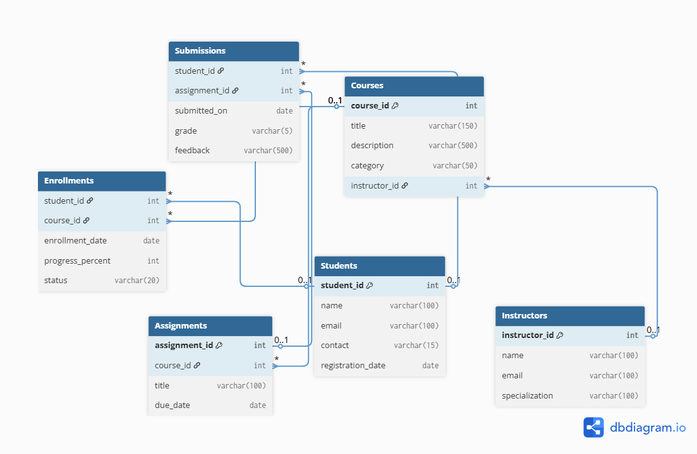

# online-learning-sql-schema
SQL-based database schema and ER diagram for an Online Learning Management System (LMS), built as part of a database design task.
📚 Online Learning Management System (LMS) – SQL DB Design

## 📌 Project Overview
This project represents a SQL-based database schema for an Online Learning Platform (like Coursera/Udemy). It includes core entities like students, instructors, courses, enrollments, assignments, and submissions.

## 📊 ER Diagram

## 🧱 Tables Created
- Students
- Instructors
- Courses
- Enrollments
- Assignments
- Submissions

## ⚙️ Relationships
- One instructor → Many courses
- One student → Many enrollments
- One course → Many assignments
- Composite keys in `Enrollments` and `Submissions` for many-to-many mapping

## 💾 SQL Features Used
- Primary & Foreign Keys
- Composite Keys
- Data Types (`VARCHAR`, `DATE`, `INT`)
- Constraints (`UNIQUE`, `CHECK`)
- ENUM values represented via `VARCHAR`

## 🚀 How to Run
1. Open MySQL Workbench 
2. Run `Online_Learning_Platform.sql` script to create tables

